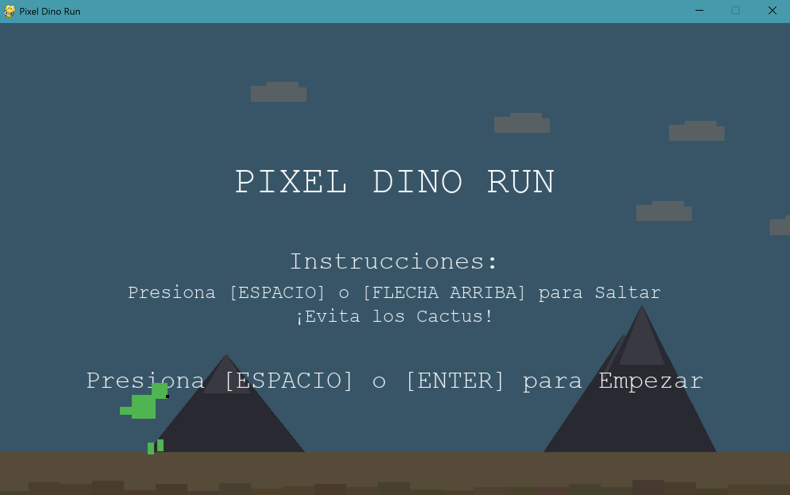

# Pixel Dino Run



## Descripción

Pixel Dino Run es un juego de estilo endless runner inspirado en el famoso juego del dinosaurio de Chrome. Controla a un dinosaurio pixelado que debe saltar sobre cactus mientras corre por un paisaje desértico. La dificultad aumenta progresivamente a medida que la velocidad del juego se incrementa.

## Características

- Gráficos pixelados simples pero atractivos
- Mecánica de juego sencilla e intuitiva
- Dificultad progresiva
- Sistema de puntuación y récord
- Elementos de fondo dinámicos (nubes, montañas)
- Distancia variable entre obstáculos para mayor desafío

## Requisitos

- Python 3.6 o superior
- Pygame 2.0.0 o superior

## Instalación

1. Clona este repositorio:
```bash
git clone https://github.com/tu-usuario/pixel-dino-run.git
cd pixel-dino-run
```

2. Instala las dependencias:
```bash
pip install -r requirements.txt
```

## Cómo jugar

1. Ejecuta el juego:
```bash
python main.py
```

2. Controles:
- **Espacio** o **Flecha Arriba** para saltar
- **R** para reiniciar después de perder
- Cierra la ventana para salir del juego

## Estructura del proyecto

```
.
├── README.md
├── game.py
├── main.py
├── sprites/
│   ├── __init__.py
│   ├── background.py
│   ├── obstacle.py
│   └── player.py
├── states/
│   ├── __init__.py
│   ├── gameover.py
│   ├── playing.py
│   ├── start.py
│   └── state.py
├── tests/
│   ├── __init__.py
│   ├── test_game.py
│   ├── test_obstacle.py
│   └── test_player.py
└── utils/
    ├── __init__.py
    ├── constants.py
    └── resources.py
```

## Desarrollo

### Configuración del entorno de desarrollo

1. Clona el repositorio
2. Crea un entorno virtual (opcional pero recomendado):
```bash
python -m venv venv
venv\Scripts\activate
```
3. Instala las dependencias:
```bash
pip install pygame
```

### Ejecutar tests
Para ejecutar un test:
```bash
python -m unittest tests.test_player
```


## Contribuir

1. Haz un fork del proyecto
2. Crea una rama para tu característica (`git checkout -b feature/nueva-caracteristica`)
3. Haz commit de tus cambios (`git commit -m 'Añadir nueva característica'`)
4. Haz push a la rama (`git push origin feature/nueva-caracteristica`)
5. Abre un Pull Request


- Inspirado en el juego del dinosaurio de Chrome
- Desarrollado como proyecto de aprendizaje de Pygame
